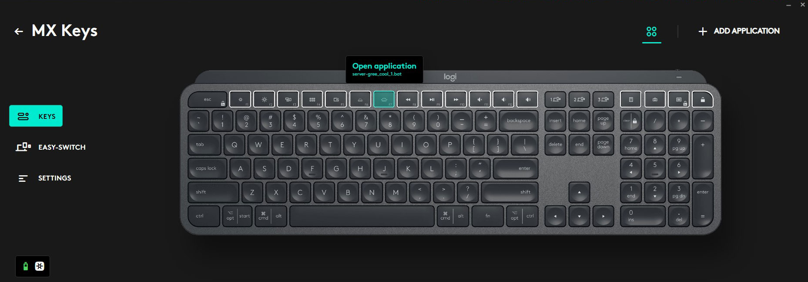

# Gree Controller

This is based on [Gree Climate by cmroche](https://github.com/cmroche/greeclimate) which is based on [Gree Remote by tomikaa87](https://github.com/tomikaa87/gree-remote) (thank you for all your hard work!)

This is a local/lan Docker web server that listens for requests to control a Gree AC Unit via api calls. This allows me to have keyboard bindings that make these api calls to turn up or down the ac/heater.

### Example to turn on the AC and adjust it up 3 degrees:
```bash
curl -s -k \
	-X POST \
	-H 'content-type: application/json' \
	-d '{"mode":"cool", "adjust":3}' \
	"http://192.168.168.11:5001/temperature-adjust"
```

### Example to turn on the Header and adjust down 2 degrees:
```bash
curl -s -k \
	-X POST \
	-H 'content-type: application/json' \
	-d '{"mode":"heat", "adjust":-2}' \
	"http://192.168.168.11:5001/temperature-adjust"
```

## Future plans:
1. Add nginx reverse proxy for SSL(https) termination
1. Add authentication support
1. Integrate with a remote temperature sensor to automatically adjust the set temperature

## Keyboard Bindings
Scripts are found under the [keyboard-bind-scripts](./keyboard-bind-scripts/) directory. My keybindings are setup using [Logi Options+](https://www.logitech.com/en-us/software/logi-options-plus.html)

